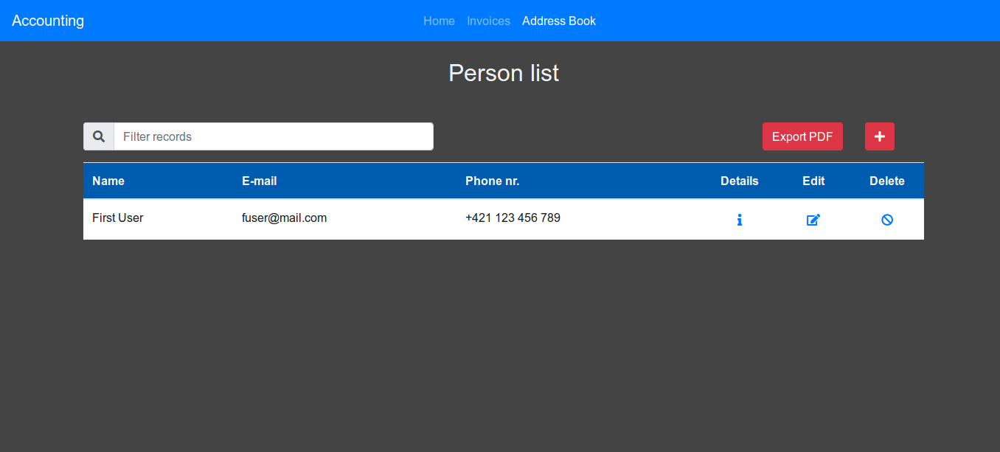

# Costs and incomes accounting

## Supervisor
* [Mgr. Luděk Bártek, Ph.D.](https://github.com/ludekbartek) učo 2154

## Developers
* [Pavel Vyskočil](https://github.com/pajavyskocil)      učo 445753 - Team leader, data layer
* [Bc. Peter Balčirák](https://github.com/balcirakpeter) učo 422570 - Service layer
* [Dominik František Bučík](https://github.com/dBucik)   učo 445348 - Web UI
* [Andrej Dravecký](https://github.com/P1R0H)            učo 445432 - Data layer, generating PDF

## Project assignment
Students will design and create a web app on the Java EE platform for revenue and expense records of a small business owner. Data will be stored in a suitable form into a native XML database. For this purpose, students will design the XML data structure and describe it in the XML Schema format. The resulting app will be distributed in a zip archive that will contain an application deployed to JSPs / Sesrvlet Jetty.

### The system should be able to:
* to register a new income
* record new expense
* to calculate the profit / loss from the beginning of the accounting period (year)
* export the data into a suitable PDF format.

### The following data will be recorded for each payment:
* payer details
* recipient information
* date of issue
* the due date of the document
* a list of billed items.

## Components
* Backend supported by eXistdb
  * Developed by Pavel Vyskočil
  * Data stored in collections using eXistdb
  * All data validated, stored as XML documents for easy manipulation
* Logging with Log4J 
* Testing with JUnit, AsssertJ and Mockito
* Accessing components with Spring application context configuration
  * Configured by Peter Balčirák 
* Embedded JETTY servlet
* Web application based on Spring MVC
  * Developed by Dominik František Bučík
  * User friendly UI easy to use
  * Intuitive design
* generating PDF files with iText library
  * Developed by Andrej Dravecký

## Basic scheme

### Use case diagram


### Class diagram


## Reports

Member | PDF | Docbook
--- | --- | --- 
Pavel Vyskočil | [](reports/vyskocil_report.pdf) | [](reports/vyskocil_report.xml)
Peter Balčirák | [](reports/balcirak_report.pdf) | [](reports/balcirak_report.xml)
Dominik František Bučík | [](reports/bucik_report.pdf) | [](reports/bucik_report.xml)
Andrej Dravecký | [](reports/dravecky_report.pdf) | [](reports/dravecky_report.xml)

[Presentation](https://docs.google.com/presentation/d/16hcUGvnzESfGkhqnccVZyqCjYSYwfC5cjPgqFa48kY0/edit?usp=sharing)

## Screenshots





## Prerequsities
Install eXistDB on your machine. Configure the access to database in config.conf file.

Install Maven on your machine

## Running the project
1.Run the eXistDB server (configuration for server can be changed in config.conf).

2.Clone and run the project
```
git clone https://github.com/LizzardCorp/pb138project.git

cd pb138project

mvn clean install

mvn jetty:run-war
```

3.Access localhost:8082/accounting/ in your browser

## Configuring database
Database can be configured in the config.conf file. Shortcut to this file is in the root of the application.
